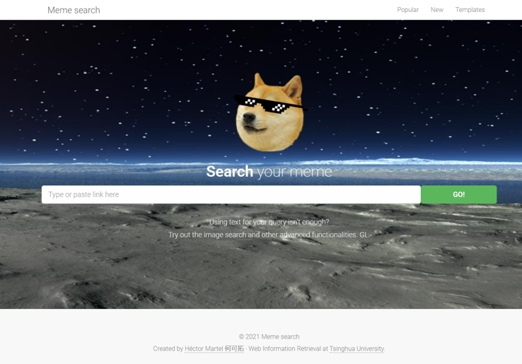
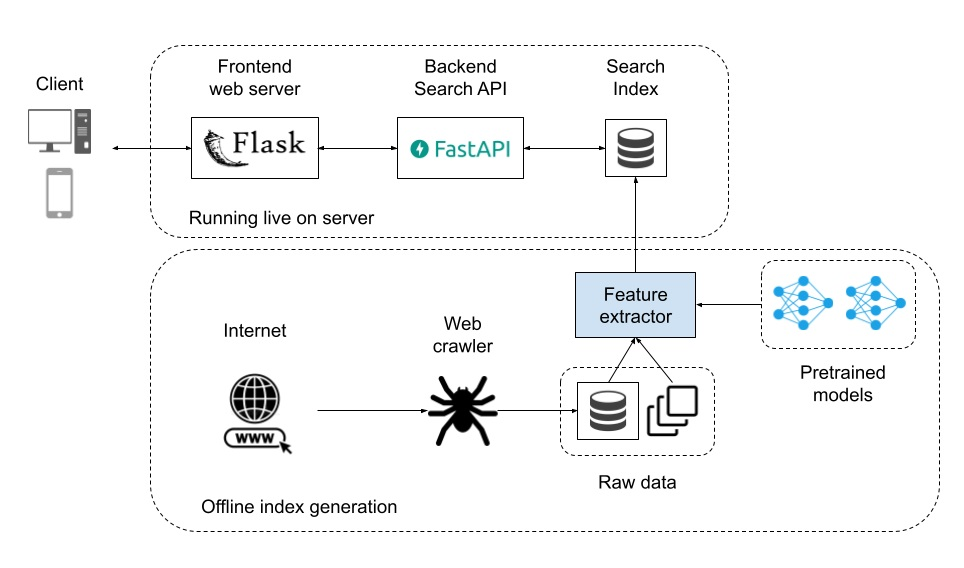
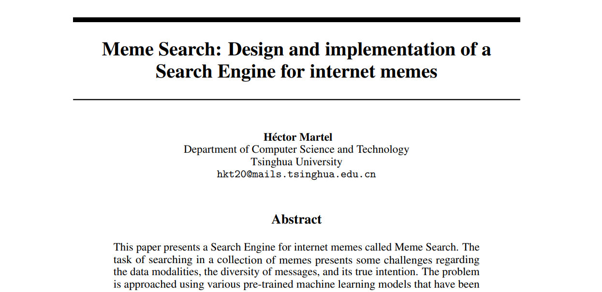

______________________________________________________________________

<div align="center">

# Meme Search


<!-- [](docs/MemeSearch_HectorMartel.pdf) -->

<!-- <a href="https://pytorch.org/get-started/locally/"></a> -->
</div>


Search Engine for memes built for the final project of Web Information Retrieval at Tsinghua University, Spring semester 2021.



## Get started

### Environment setup
Clone this repository to your system.

```
$ git clone https://github.com/hmartelb/meme-search.git
```

Make sure that you have Python 3.6 installed in your system. It is recommended to create a virtual environment to install the dependencies. Open a new terminal in the master directory and install the dependencies from ``requirements.txt`` (frontend) and ``requirements-api.txt`` (backend) by executing this command:

```
$ (venv) pip install -r requirements.txt
$ (venv) pip install -r api/requirements-api.txt
````

Alternatively, you can create separate virtual environments for each part. 

### Run the application

Initiate the frontend application in one terminal by running this command:
```
$ (venv) python frontend/wsgi.py [--port <FRONTEND_PORT>]
````
>The frontend needs to know the API endpoints to send the requests, including IP and PORT. To change the default ports, modify the file ``frontend/config.py``.

Open another terminal and start the Search API as follows (the port argument must match the one specified in the frontend configuration file):

```
$ (venv) python api/app.py [--port <BACKEND_PORT>]
````

You should now be able to access the website by opening your browser and typing ``localhost:<FRONTEND_PORT>``. 

> To see the methods available in the Search API, you can see the auto-generated documentation in ``localhost<BACKEND_PORT>/docs``.

## System design

All the system is written in Python, using the Flask framework for the **frontend
web server** and FastAPI for the **backend Search API**. These 2 components run live on the server and have differentiated tasks: 

* The frontend server communicates with the user, providing it with the HTML and other assets to visualize the website. 
* The backend API handles the connection with the search index and solves the incoming queries, using JSON as input and output data format. 

The crawling and feature extraction procedures can be performed off-line (a GPU-enabled machine is recommended). The pre-trained Machine Learning models run in PyTorch.



### Libraries used

Component           | Libraries 
---                 | --- 
Frontend            | Flask, Flask-Caching, Flask-Assets
Backend             | FastAPI, PyTorch, Scipy spatial, Pandas
Feature extraction  | EasyOCR, PyTorch, Scipy spatial, Pandas, Beautifulsoup

## Want to know more?

If you are courious about the more technical details behind this Search Engine, I encourage you to read the [project report](docs/MemeSearch_HectorMartel.pdf). 

<p align="center">
    <a href="docs/MemeSearch_HectorMartel.pdf" target="_blank">
        
    </a>
</p>

## Contact

Please do not hesitate to reach out to me if you find any issue with the code or if you have any questions. 
* Personal email: hmartelb@hotmail.com
* LinkedIn profile: https://www.linkedin.com/in/hmartelb/

## License

```
MIT License

Copyright (c) 2021 Héctor Martel

Permission is hereby granted, free of charge, to any person obtaining a copy
of this software and associated documentation files (the "Software"), to deal
in the Software without restriction, including without limitation the rights
to use, copy, modify, merge, publish, distribute, sublicense, and/or sell
copies of the Software, and to permit persons to whom the Software is
furnished to do so, subject to the following conditions:

The above copyright notice and this permission notice shall be included in all
copies or substantial portions of the Software.

THE SOFTWARE IS PROVIDED "AS IS", WITHOUT WARRANTY OF ANY KIND, EXPRESS OR
IMPLIED, INCLUDING BUT NOT LIMITED TO THE WARRANTIES OF MERCHANTABILITY,
FITNESS FOR A PARTICULAR PURPOSE AND NONINFRINGEMENT. IN NO EVENT SHALL THE
AUTHORS OR COPYRIGHT HOLDERS BE LIABLE FOR ANY CLAIM, DAMAGES OR OTHER
LIABILITY, WHETHER IN AN ACTION OF CONTRACT, TORT OR OTHERWISE, ARISING FROM,
OUT OF OR IN CONNECTION WITH THE SOFTWARE OR THE USE OR OTHER DEALINGS IN THE
SOFTWARE.
```
